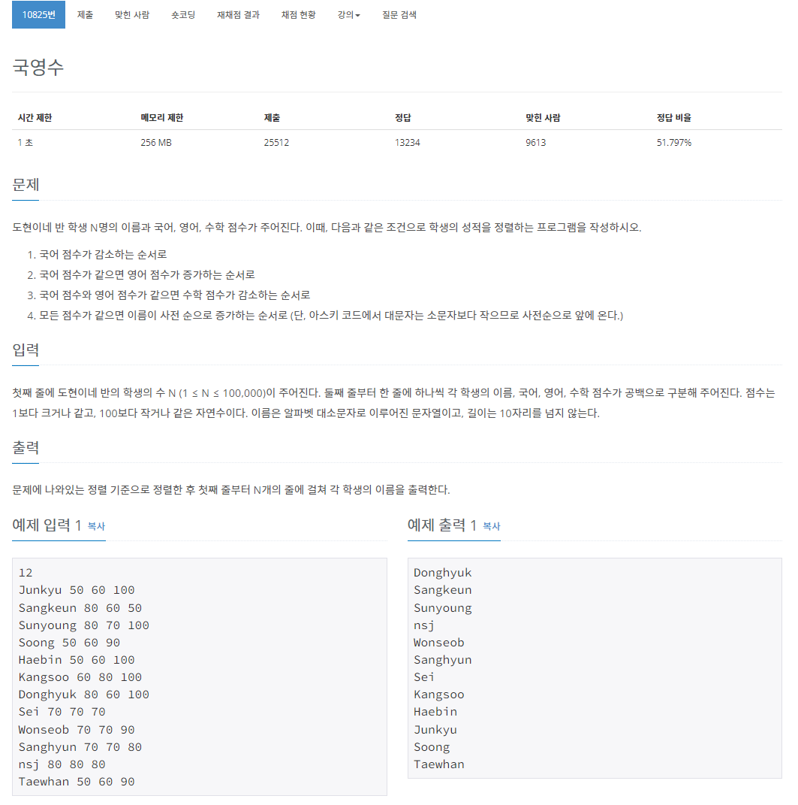

## Class

### 공부 범위

- 이것이 자바다 p.186 ~ p.276
- 구글링

### 질문

- 절차지향 vs 객체지향을 비교하고 객체지향을 쓰는 이유를 말해주세요

- 클래스 vs 객체 vs 인스턴스 vs 생성자의 차이점을 말해주세요

- 오버라이딩vs오버로딩 차이점을 말해주세요

- static 키워드는 언제 쓰면 좋을까요? 언제 쓰면 좋지 않을까요?

- object클래스란 무엇인가요? object클래스의 메서드들은 무엇이 있나요?

- (추가) 각자 클래스에 대해 공부하면서 궁금했던 점들을을 질문해주세요

### 문제

- 
