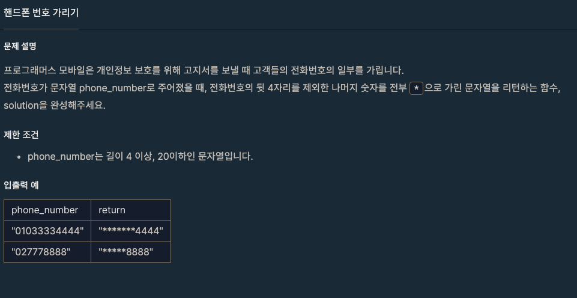

# Wrapper Class, StringBuilder, StringBuffer

---

## Wrapper Class

### 공부 범위

- 이것이 자바다 p.527 ~ p.532
- 구글링

### 질문

- 래퍼 클래스를 사용하는 이유 2가지
- 기본 형과 래퍼 클래스의 객체 타입의 차이점 2가지
- 래퍼 클래스 값을 비교하는 방법
- JDK 1.8 부터 추가된 기능

## StringBuilder, StringBuffer

### 공부 범위

- 이것이 자바다 p.514 ~ p.516
- 구글링

### 질문

- String vs StringBuilder, StringBuffer 차이
- StringBuilder vs StringBuffer 차이
- JDK 1.5 부터 String 문자열 연산시 변경점

### 문제

- 